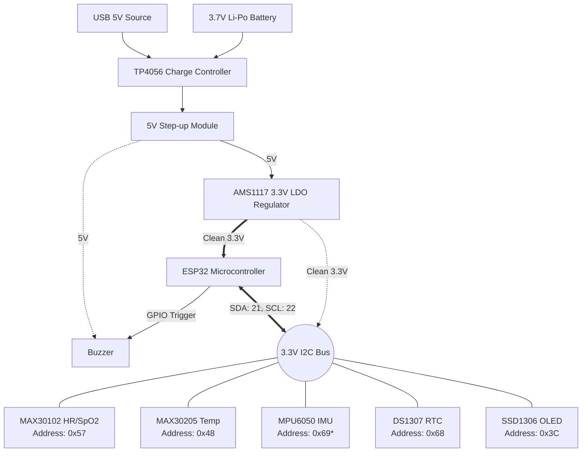

# Multi-Vital Health Monitor 🩺

A comprehensive, real-time wearable health monitor built on the **ESP32** utilizing **FreeRTOS** for robust multitasking. It reads vitals from various I2C sensors and streams the data over WiFi to a beautiful local **Python Flask Dashboard**.

## 🌟 Features

- **Heart Rate & SpO2:** High-precision pulse oximetry using the MAX30102 / MAX30105.
- **Body Temperature:** Clinical-grade temperature tracking via the MAX30205 sensor.
- **Motion & Fall Detection:** 6-DoF IMU (MPU6050) tracking acceleration and gyroscope data to detect sudden falls.
- **Real-Time OLED Display:** On-device SSD1306 OLED screen for instant local feedback.
- **FreeRTOS Architecture:** Dedicated concurrent tasks for sensors, display, API networking, and Over-The-Air (OTA) updates using queues and mutexes.
- **Interactive UART CLI:** A fully-featured, reliable command-line interface over Serial (`med_mon>`) for dynamically configuring WiFi and API settings without recompiling the code, featuring live sensor streaming and diagnostic controls.
- **Live Web Dashboard:** A Python Flask backend that receives JSON payloads from the ESP32 and broadcasts them to a modern, vibrant web interface via Server-Sent Events (SSE).
- **Comprehensive Documentation:** LaTeX-compiled project report with detailed architecture, task configuration logic, and performance metrics included in `docs/`.

## 📁 Project Structure

- `src/` - ESP32 C++ source code organized into modular FreeRTOS tasks.
- `include/` - Core configuration headers (`config.h`, `types.h`).
- `lib/` - Custom or modified libraries.
- `server/` - Python Flask backend and static frontend dashboard files.
- `docs/` - Comprehensive LaTeX project report, PDF, and generated graphs.
- `platformio.ini` - PlatformIO build configuration.

## 🚀 Getting Started

### 1. Hardware & Wiring Setup
A wearable medical device requires a clean and stable power supply. This project utilizes a specific power regulation pipeline to ensure the analog-to-digital converters in the sensors don't suffer from voltage droop or electrical noise.

#### Wiring Diagram



**Critical Wiring Notes:**
- **MPU6050 AD0 Pin (*)**: You **MUST** tie the AD0 pin of the MPU6050 to 3.3V. This shifts its I2C address from `0x68` to `0x69`, preventing a hard collision with the DS1307 RTC which is permanently fixed at `0x68`.
- **Power**: Do not power the I2C sensors directly from the ESP32's internal 3.3V pin if you can avoid it, as Wi-Fi bursts can cause voltage dips. The external AMS1117 provides a dedicated, clean rail for the sensors.

### 2. Flash the ESP32
Use **PlatformIO** to build and upload the firmware to your ESP32:
```bash
pio run -t upload
```

### 3. Device Configuration via UART CLI
You no longer need to hardcode credentials in your code! Once the device boots up, open your Serial Monitor (at `115200` baud) to access the interactive CLI.

At the `med_mon>` prompt, you can easily set up your device:
```text
med_mon> set wifi Your_WiFi_SSID Your_WiFi_Password
med_mon> set api http://<YOUR_COMPUTER_IP>:3000/api/vitals Your_Token
med_mon> show
med_mon> reboot
```
*Note: Any settings changed will automatically be saved to Non-Volatile Storage (NVS) across reboots.*


## 💻 UART CLI Commands Reference

- `help` - Show the help menu
- `show` / `status` - Display current config and system health (memory, stack high-water marks, queue depths)
- `read` - Read a single sensor snapshot
- `stream` / `monitor` - Continuously output live sensor readings to the console (press any key to stop)
- `start` / `debug on` - Enable live diagnostic logging output
- `stop` / `debug off` - Disable live diagnostic logging output
- `logs` - Show EEPROM log history
- `reboot` / `restart` - Reboot the ESP32 chip
- `set wifi <ssid> <password>` - Configure WiFi network
- `set api <url> <token>` - Configure the API telemetry endpoint
- `set time <YYYY-MM-DD> <HH:MM:SS>` - Manually sync the on-device RTC

## 🛠️ Built With

- [PlatformIO](https://platformio.org/)
- [FreeRTOS](https://freertos.org/)
- [Python](https://www.python.org/)
- [Flask](https://flask.palletsprojects.com/)
- Vanilla CSS & HTML5

## 📝 License
This project is open-source and available under the MIT License.
